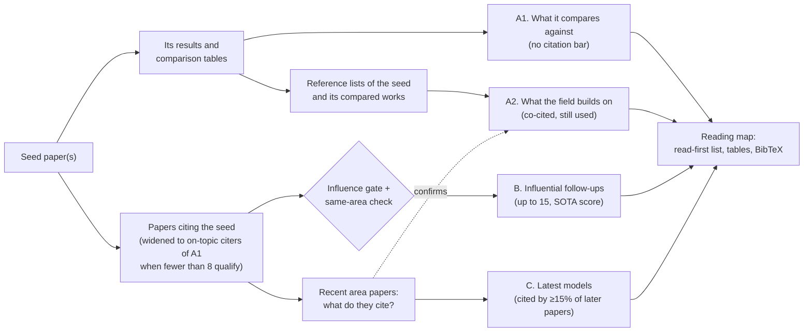

# citation-snowball

[](https://github.com/Andy-LZH/citation-snowball/actions/workflows/ci.yml)


[](LICENSE)

An [Agent Skill](https://agentskills.io) that turns a paper you like into a **short reading map**:

- what it compares against;
- the datasets and models it and those works all build on;
- who influential has built on it;
- which new models recent work in its area relies on.

Every paper comes with code, stars and one line on why to read it. You also get a "read these first" list and a
BibTeX file.

Works with **Claude Code**, **OpenAI Codex** and **GitHub Copilot** (VS Code and Copilot CLI), and any other agent
that supports `SKILL.md` skills.

> **New in 1.3:** a reading map instead of a long list. Version 1.2 kept every influential paper it found: for one
> 2025 seed, 81 papers plus 641 overflow candidates. Version 1.3 gives 45 papers for the same seed:
> - 14 it compares against;
> - 12 foundations it and those works cite;
> - 15 influential follow-ups;
> - 4 latest models.
>
> 8 of them are in "read these first". Details in the [changelog](CHANGELOG.md).

## What you get

An excerpt from a [real map](examples/instructpart.md) for **InstructPart** (ACL 2025), a benchmark for
task-oriented part segmentation:

> ## Read these first
>
> ↩ = what the seed builds on · ↪ = newer work
>
> 1. [**LISA**: Reasoning Segmentation via Large Language Model](https://arxiv.org/abs/2308.00692) · 2023 · 1.1k citations · [JIA-Lab-research/LISA](https://github.com/JIA-Lab-research/LISA) ★2.7k  
>    ↩ Compared in the seed (benchmarked model). Defines reasoning segmentation and the [SEG]-token MLLM that the seed finds strongest zero-shot and builds its baseline on; it reasons about whole objects, not task-relevant parts.
> 2. [Scene Parsing through ADE20K Dataset](https://doi.org/10.1109/CVPR.2017.544) · 2017 · 4.1k citations · [CSAILVision/semantic-segmentation-pytorch](https://github.com/CSAILVision/semantic-segmentation-pytorch) ★5.1k  
>    ↩ Foundation: cited by 6 of 15 (seed + compared works) · 14% of recent area papers. Scene parsing dataset with object and part annotations over 150 categories; the standard semantic-segmentation benchmark the compared open-vocabulary models report on, at object rather than task level.
> 3. [Generation and Comprehension of Unambiguous Object Descriptions](https://arxiv.org/abs/1511.02283) · 2015 · 1.8k citations  
>    ↩ Foundation: cited by 8 of 15 (seed + compared works) · 23% of recent area papers. Introduces RefCOCOg, longer referring expressions over COCO images, with a joint generation-comprehension model; the object-level referring benchmark behind most compared grounding models, where the seed's queries name task-relevant parts.
>
> …
>
> 7. [**SAM 3**: Segment Anything with Concepts](https://arxiv.org/abs/2511.16719) · 2025 · 1.2k citations · [facebookresearch/sam3](https://github.com/facebookresearch/sam3) ★12k  
>    ↪ Latest model: cited by 24% of the area's papers since it appeared (23 of 94). Segments every instance of a concept given a short noun phrase or image exemplar; the model SAM3-I builds on, and the strongest new prompt-to-mask baseline to test on part instructions.
> 8. [**Qwen2.5-VL** Technical Report](https://arxiv.org/abs/2502.13923) · 2025 · 6.1k citations · [QwenLM/Qwen3-VL](https://github.com/QwenLM/Qwen3-VL) ★20k  
>    ↪ Latest model: cited by 23% of the area's papers since it appeared (43 of 188). Qwen vision-language model that grounds with boxes and points in absolute coordinates; the base MLLM of Seg-Zero, Seg-R1 and other 2025 RL reasoning segmenters.
>
> ### A2. What the field builds on
>
> _(datasets and benchmarks: rows 1-2 and 5 of 6; citation links omitted)_
>
> | # | Paper | Year | Cites | Code | Cited by | Why read it |
> |--:|---|--:|--:|---|---|---|
> | 1 | [Generation and Comprehension of Unambiguous Object Descriptions](https://arxiv.org/abs/1511.02283) | 2015 | 1.8k | — | 8 of 15<br>23% of recent work | Introduces RefCOCOg, longer referring expressions over COCO images, with a joint generation-comprehension model; the object-level referring benchmark behind most compared grounding models, where the seed's queries name task-relevant parts. |
> | 2 | [**Microsoft COCO**: Common Objects in Context](https://arxiv.org/abs/1405.0312) | 2014 | 56k | — | 11 of 15<br>21% of recent work | COCO's images and instance masks underlie most datasets here (the RefCOCO family, PACO's LVIS split); object categories only, with no parts or instructions. |
> | 5 | [Scene Parsing through ADE20K Dataset](https://doi.org/10.1109/CVPR.2017.544)<br><sub>also published as Semantic Understanding of Scenes Through the ADE20K Dataset</sub> | 2017 | 4.1k | [CSAILVision/semantic-segmentation-pytorch](https://github.com/CSAILVision/semantic-segmentation-pytorch) ★5.1k · docs 5/5 | 6 of 15<br>14% of recent work | Scene parsing dataset with object and part annotations over 150 categories; the standard semantic-segmentation benchmark the compared open-vocabulary models report on, at object rather than task level. |
>
> ## C. Latest models to keep an eye on
>
> _(all 4 rows; citation links omitted)_
>
> | # | Paper | Year | Cites | Code | Used by | Why read it |
> |--:|---|--:|--:|---|---|---|
> | 1 | [**SAM 2**: Segment Anything in Images and Videos](https://arxiv.org/abs/2408.00714) | 2024 | 4.5k | [facebookresearch/sam2](https://github.com/facebookresearch/sam2) ★20k · docs 5/5 | 33% of later area papers<br>_77 of 231_ | Extends SAM to video with a streaming memory; the default mask decoder of 2025 reasoning-segmentation follow-ups such as Sa2VA and Seg-Zero. |
> | 2 | [**Qwen3-VL** Technical Report](https://arxiv.org/abs/2511.21631) | 2025 | 2.6k | [QwenLM/Qwen3-VL](https://github.com/QwenLM/Qwen3-VL) ★20k · docs 5/5 | 25% of later area papers<br>_23 of 92_ | The newest Qwen vision-language family, with box and point grounding; the next base MLLM to benchmark on part instructions, as the seed did with its 2023 MLLMs. |
> | 3 | [**SAM 3**: Segment Anything with Concepts](https://arxiv.org/abs/2511.16719) | 2025 | 1.2k | [facebookresearch/sam3](https://github.com/facebookresearch/sam3) ★12k · docs 5/5 | 24% of later area papers<br>_23 of 94_ | Segments every instance of a concept given a short noun phrase or image exemplar; the model SAM3-I builds on, and the strongest new prompt-to-mask baseline to test on part instructions. |
> | 4 | [**Qwen2.5-VL** Technical Report](https://arxiv.org/abs/2502.13923) | 2025 | 6.1k | [QwenLM/Qwen3-VL](https://github.com/QwenLM/Qwen3-VL) ★20k · docs 5/5 | 23% of later area papers<br>_43 of 188_ | Qwen vision-language model that grounds with boxes and points in absolute coordinates; the base MLLM of Seg-Zero, Seg-R1 and other 2025 RL reasoning segmenters. |

The full map also has:

- an at-a-glance table;
- A1, the 14 models and datasets the seed compares against;
- A2's six models and methods (CLIP, SAM, LLaVA, …);
- section B, 15 follow-ups: 2 cite the seed, and 13 recent ones build on its compared works;
- a collapsed list of the papers that also qualified;
- a footnote with the exact bars it used.

In the full report each citation count links to a Google Scholar search, so you can check it.

## How it decides

The seed is assumed to be good. So what it compares against is worth knowing, what it and those works all cite is the
field's foundation, and the forward search keeps only influential work in the same area.



**Co-citation (A2 and C).** The script reads the reference lists of the seed and its compared works, and of up to
1,000 recent papers in the area (the last 30 months).

- **A2:** a paper cited by at least 20% of the seed and compared works, and still cited by recent work, is a
  foundation. So is an older paper a quarter of recent work cites. Datasets and benchmarks come first, then models
  and methods.
- **C:** a paper from the last 30 months cited by at least 15% of the area papers published after it is a latest
  model. This is how the map reaches models no citation search can: Semantic Scholar has no reference list for SAM 3
  or Qwen2.5-VL, so they never show up as citers, but a quarter of InstructPart's recent area builds on them.

**The influence gate (B).** A follow-up is kept when it has enough citations for its age, *or* enough GitHub stars
on a verified repo whose README documents the implementation. The README check gives one point each for setup,
usage, training, evaluation and released weights, and needs 4 of 5. Counts are Semantic Scholar's.

| Follow-up | Any age | Published ≤ 12 months ago | 12-24 months | Older |
|---|---|---|---|---|
| cites the seed | ≥50 citations, or ★≥1000 | ≥10 citations, or ★≥100 | ≥25 citations, or ★≥250 | (any-age bar) |
| widening: cites a compared work, on topic | - | ≥20 citations, or ★≥150 | ≥40 citations, or ★≥250 | left out |

Every follow-up must also cite one of the field's 30 strongest co-citations. That same-area check keeps out papers
that cite the seed in passing. Follow-ups are ranked by a **SOTA score**: citations per month plus half the GitHub
stars per month (log scale), +0.5 for the last 12 months, -0.5 for surveys, with at most one survey per section.

When fewer than 8 papers citing the seed qualify, B widens to recent, on-topic papers citing the compared works. It
skips the citers of hubs such as SAM or CLIP, and balances its slots across the compared works. Every bar is a flag
(`--gate seed.recent=5,100`, `--min-citations 100`, `--expand always`, `--latest-months 36`, ...); see
[`references/methodology.md`](references/methodology.md).

The agent supplies judgment at three points:

- confirming the comparison set (A1);
- choosing keywords that define the seed's topic;
- writing the one-line reasons, the read-first picks and any dataset/model label fixes.

A helper script does all the API work.

## Install

**Claude Code**

```sh
git clone https://github.com/Andy-LZH/citation-snowball ~/.claude/skills/citation-snowball
```

**Claude Code + Codex + Copilot**, with one shared copy:

```sh
git clone https://github.com/Andy-LZH/citation-snowball ~/.agents/skills/citation-snowball
ln -s ~/.agents/skills/citation-snowball ~/.claude/skills/citation-snowball
```

- Codex and VS Code Copilot read `~/.agents/skills` directly.
- Copilot CLI needs version 1.0.11 or later.
- Codex sandboxes network access by default; approve it when the skill runs.

**Update:** `git -C ~/.agents/skills/citation-snowball pull` (or the `~/.claude/skills` path). Version 2 changed
the workdir format, so start new runs after updating.

**claude.ai:** zip the `citation-snowball` folder and upload it under Customize → Skills. The script needs internet
access to the APIs below, so it only works if your code-execution settings allow it.

## Use

```
/citation-snowball https://arxiv.org/abs/2306.01567
```

Or ask in plain language. In Codex, mention `$citation-snowball`.

- *"What should I compare DoRA against, and who has built on it since?"*
- *"Here are two papers I like: 2505.18291 and 2407.09686. Give me a reading list."* Several seeds share one map.
- *"Only papers with at least 100 citations."* The agent passes `--min-citations 100`.
- *"Always include the recent state of the art."* The agent passes `--expand always`.
- *"Which new models should I keep an eye on for this task?"* Section C answers it.

You get `<name>-reading-map.md` and `<name>-reading-map.bib` in the current directory.

## Requirements and setup

- Python 3.8+ (standard library only) and internet access.
- **Recommended: a free [Semantic Scholar API key](https://www.semanticscholar.org/product/api#api-key-form).**
  Without one, requests go through a shared pool that is often busy. The script retries patiently, so a run takes
  5-20 minutes instead of one or two.
  ```sh
  echo 'export S2_API_KEY=your-key' >> ~/.zshrc
  ```
- **Recommended: `gh auth login` (or `GH_TOKEN`)** for GitHub stars and READMEs. Without a token, stars come from
  Hugging Face's cached counts and READMEs from raw.githubusercontent.com.
- Check your setup:
  ```sh
  python3 ~/.claude/skills/citation-snowball/scripts/fbsearch.py doctor
  ```

## Commands

The agent runs these for you; they are listed for the curious and for contributors.

| Stage | Command | Output |
|---|---|---|
| Backward | `fbsearch.py backward SEED [SEED ...]` | Proposed comparison set with each reference's role and evidence (e.g. `in Table 2 (row)`) |
| Review | `fbsearch.py core --workdir W ...` | The agent fixes roles, drops hubs and components, adds misses |
| Forward | `fbsearch.py forward --workdir W --query ... --keywords ...` | `pool.json` (everything screened, and the co-citation counts), then runs `select` |
| Select | `fbsearch.py select --workdir W [gate flags]` | `candidates.json`, `briefs.md`; re-cuts the pool in seconds, e.g. after excluding papers |
| Reasons | the agent writes `diffs.json` | One "why read it" sentence per paper, read-first picks, dataset/model label fixes |
| Report | `fbsearch.py report --workdir W --out map.md` | `map.md` and `map.bib` |

Details: [`references/methodology.md`](references/methodology.md),
[`references/data-sources.md`](references/data-sources.md), [`references/report-format.md`](references/report-format.md).

## Data sources

- **Semantic Scholar:** citations, references, counts, abstracts and BibTeX.
- **arXiv:** full text and metadata.
- **Hugging Face:** paper pages, models, datasets and spaces.
- **GitHub:** repos, stars and READMEs.
- **OpenAlex:** most-cited citers, optional.

Responses are cached in `~/.cache/citation-snowball`.

**Google Scholar is never queried.** It has no API, its robots.txt disallows automated access, and Google blocks
automated traffic. Citation counts are therefore Semantic Scholar's, which are usually 1.4-1.8x lower than Google
Scholar's.

## Limitations

- **Full text.** Works best for arXiv papers with an HTML version. For other papers the script saves the PDF, and
  the agent reads the tables itself.
- **Semantic Scholar gaps.** Some papers lack reference lists, and a few records are duplicated. OpenAlex
  undercounts arXiv-heavy fields, so it is only used to find candidates, never for counts.
- **Code discovery** relies on links from the paper, its Hugging Face page or a GitHub search. Repos that neither
  link back to the paper nor name it can be missed. Weak matches are shown as unverified and never count toward the
  gate.
- **The docs score is a heuristic.** It reads README headings and wording, not the code.
- **Co-citation needs reference lists.**
  - A2 and C rest on the reference lists Semantic Scholar has; the report says how many.
  - A niche area with few recent papers gives a thin C.
  - The dataset/model split in A2 is a heuristic the agent corrects.
- **Widening's quality depends on `--keywords`.** Bare generic words such as "segmentation" let in neighbouring work.

## Contributing

Issues and pull requests are welcome, especially reports of a paper the map should have found, with the seed and
the command. See [CONTRIBUTING.md](CONTRIBUTING.md) for setup, the offline test suite, and how to propose a change
to the gates. Releases follow [Semantic Versioning](https://semver.org); every change is listed in the
[changelog](CHANGELOG.md).

## License

[MIT](LICENSE)
