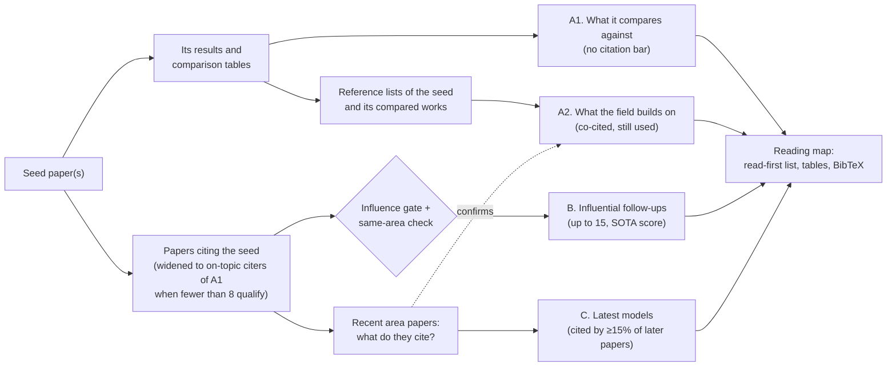

# Methodology

How `fbsearch.py` decides what goes into the reading map, and how to judge its output.

Contents:

1. Background: snowballing and co-citation
2. The sections at a glance
3. Paper types and the core set
4. How reference roles are inferred (backward)
5. Several seeds
6. Co-citation counts
7. A2: what the field builds on
8. C: the latest models to keep an eye on
9. B: influential follow-ups
10. Verification
11. The influence gate
12. Ranking, caps and the read-first list
13. Judging the result
14. Limitations

## 1. Background: snowballing and co-citation

Backward snowballing reads a paper's reference list. Forward snowballing collects the papers that cite it (Wohlin,
"Guidelines for snowballing in systematic literature studies", EASE 2014). Done naively, both directions are noisy:

- a paper cites dozens of things it merely uses;
- a popular baseline has tens of thousands of citers.

Version 1 narrowed both directions to the seed's comparison set and kept every connected, influential paper. For a
2025 seed (InstructPart) that was 81 papers plus 641 overflow candidates: complete, but not a reading list.

Version 2 starts from one assumption: **the seed is good.** Several things follow.

- What the seed compares against is worth knowing, whatever its citation count; its authors vetted it.
- What the seed *and* the works it compares against all cite is the field's foundation. This is **co-citation
  analysis** (Small, "Co-citation in the scientific literature", 1973): papers cited together by the same works
  belong together.
- Forward, only influential work in the same area is worth a reader's time.
- What the area's *newest* papers all cite tells you which new models to keep an eye on. That includes models that
  no citation search can reach.

## 2. The sections at a glance



| Section | Direction | Contents | Cap |
|---|---|---|---|
| A1 | backward | included core papers with a table role (baseline, benchmarked model, compared dataset or benchmark) | none |
| - | backward | included core papers with role `related`: one line under A1, unless A2 lists them | 12 |
| A2 | co-citation | foundations cited by the seed and its compared works and still cited by recent work, or field consensus (section 7) | 6 datasets + 6 models (`--max-foundations`) |
| B | forward | influential papers citing the seed; widened to on-topic citers of the compared works when short (section 9) | 15 (`--max-follow-ups`) |
| C | co-citation | the latest models the area's recent papers build on (section 8) | 8 (`--max-latest`) |
| also | forward | follow-ups beyond the cap, and surveys after the first | 20 listed (`--max-also`), collapsed |

`forward` gathers everything and saves it to `pool.json`, including the co-citation counts. `select` applies the
bars and caps. It is pure apart from fetching abstracts, BibTeX and code for the kept papers, all of which is cached.
So changing a bar, excluding a paper or relabelling a dataset takes seconds.

## 3. Paper types and the core set

The seed's type decides which references count as its comparison set:

| Type | Comparison set |
|---|---|
| method | methods in its results tables (baselines), plus the closest related methods |
| dataset | datasets in its comparison / statistics table or reviewed in related work, plus the closest related work |
| benchmark | benchmarks it positions against, plus the models it evaluates |
| mixed | the union |

The type is guessed from the title and abstract ("we introduce a dataset / benchmark ..."). A paper that introduces
a dataset and also says it benchmarks or evaluates models ("We benchmark modern models ...") is treated as `mixed`.
For a pure dataset paper, the models it evaluates are still listed in section A1, but they are not part of the
default core set, because their citers are mostly a neighbouring model literature. Override the type with `--type`.

The **core set** is the subset of references marked `include: true` in `core.json`: the "compared works". It does
three jobs:

- its table roles are section A1, listed in full;
- its reference lists, with the seed's, are what section A2 counts;
- its citers (minus hubs) are where section B widens to.

`backward` proposes a core set and the agent reviews it. The proposal often misses models that a results table
names without a citation, or cites only in related work, so the review step is not optional.

## 4. How reference roles are inferred (backward)

The script reads the seed's arXiv HTML (arxiv.org/html, else ar5iv), so it knows each table, each section and the
sentence around every citation. For each reference it collects this evidence, strongest first.

1. **Table row.** The citation sits in a row of a results table (`S4.T2(row)`). Or the row names the method without
   citing it, and the name matches a reference's short name (`S5.T1(row-label)`). For example, "LoRA" matches
   "LoRA: Low-Rank Adaptation ...", and "Prefix" matches "Prefix-Tuning".
   - For a method paper, this is the classic baseline signal.
   - If the table's caption looks like a dataset comparison ("comparison with existing datasets", "statistics of
     benchmarks"), the rows are compared datasets.
   - Cells spanning several rows ("LLaMA-7B" above six methods) name the backbone or setting. A reference matching
     one is treated as a component, not a baseline.
2. **Table header.** Column headers usually name datasets or benchmarks. A reference that appears only in headers
   is treated as data: an evaluation dataset for a method paper, a compared dataset for a dataset paper.
3. **Comparison sentence.** A citation sentence with a strong cue: "compared with", "outperforms", "baseline",
   "unlike", "vs.". Two kinds of sentence count as **usage** instead:
   - ones that also say "we use / adopt / follow / build on";
   - citations whose marker directly follows "on X", "using X", "fine-tuning X" or "X backbone", in at least half
     of their occurrences ("outperforms LoRA when fine-tuning LLaMA [37]").
4. **Related work.** The reference is cited in a related-work or background section.

Table **captions** are weak evidence: they mostly cite evaluation data or components ("using a FocalNet-DINO
detector [53]"). A reference seen only in captions becomes `eval_dataset` (if it looks like data) or `background`.

The roles are `baseline`, `benchmarked_model`, `compared_dataset`, `compared_benchmark`, `related`, `eval_dataset`
and `background`. The default core set takes every table-backed comparison role, plus the top `related` papers.
Related papers are ranked by evidence and **topic overlap**: the share of the reference title's words (crudely
stemmed) that also occur in the seed's title and abstract. A related paper needs an overlap of at least 0.2, or an
explicit comparison sentence, to be included by default.

**No HTML.** For non-arXiv papers, the script falls back to Semantic Scholar's citation contexts and intents, and
saves `paper.pdf` so the agent can read the tables.

**Missing references.** Semantic Scholar sometimes lists few or none of a paper's references, misses a key one, or
knows one only by title. The script resolves every unmatched or title-only bibliography entry itself:

- arXiv IDs and DOIs in the entries go through one batch lookup;
- titles go through an arXiv title search, then Semantic Scholar title matching.

It looks up at most `--max-bib-lookups` titles (25), entries named in tables first.

## 5. Several seeds

`backward A B C` runs the backward stage for each seed into `seeds/<key>/` and merges the per-seed proposals:

- A reference included by any seed is included. It keeps its strongest role: baseline beats benchmarked model,
  which beats compared dataset, and so on.
- Each core paper records which seeds compare against it (`seeds`), and its evidence is prefixed with the seed's
  name.
- A seed that cites another seed doesn't make that seed a core paper.
- When the merged set exceeds `--max-core`, table roles and papers compared by several seeds are kept first.

Forward, B holds papers citing any seed, balanced across the seeds (a paper citing several forms its own group). The
backward co-citation counts the reference lists of all seeds and all compared works. Section A1 gets a "Compared by"
column, and section B's rows say which seed they cite. Running `backward` again for one seed in the same workdir
(e.g. with `--type`) replaces only that seed, but it rebuilds the merged core set, so make `core` edits afterwards.

## 6. Co-citation counts

`forward` counts citations in two directions.

**Backward.** It reads the reference lists of the seeds and the compared works (`n_b` of them are found), together
with the citation sentences Semantic Scholar has for each reference. For every paper cited by at least 2 of them it
records:

- `k_b`: how many of them cite it;
- how many cite it in a sentence that reads as dataset use.

**Forward.** The **recent area** is the papers from the last `--latest-months` (30) that cite a seed, or cite a
compared work and match the topic (`--keywords` in the title or abstract, or found by the topic search).
- `forward` reads the reference lists of up to `--area-cap` of them, newest first (1,000 with an API key, 400
  without).
- For the 300 papers they cite most, it records the `support`: how many area papers cite it.

**Shares.** A paper can only be cited by papers published after it. So the forward share is `support / eligible`,
where `eligible` counts the area papers published after the cited paper. Two details keep small counts from looking
big:
- `eligible` is floored at 10, so 2 of 3 does not read as 67%;
- C requires at least 10 eligible papers.

**Specificity.** `idf = log(corpus size / citations)`, with about 214 million papers in Semantic Scholar. COCO and
CLIP (56-57k citations) score about 8.3; a part dataset with 200 citations scores about 13.9. So being co-cited
counts for more when a paper is not cited everywhere.

The block is stored in `pool.json` under `cocitation`, with metadata (and abstract) for every counted paper.

## 7. A2: what the field builds on

A paper is a foundation when, beyond the seeds and the A1 papers, it takes **path (a)** or **path (b)**:

| Path | Backward | Forward | Age |
|---|---|---|---|
| (a) co-cited and still used | `k_b` ≥ max(3, 20% of `n_b`) | share ≥ 5% and support ≥ 3 | any |
| (b) field consensus | - | share ≥ 25% and support ≥ 3 | older than `--latest-months` |

Both paths need at least 100 citations.
- Path (a)'s confirmation is skipped when the recent area has fewer than 10 papers with reference lists (an old
  seed, or a niche). Otherwise papers that the seed's generation cited but nobody cites any more stay out: MaskCLIP,
  ViLD, Visual ChatGPT and RegionCLIP in the calibration run.
- Path (b) catches what the field adopted after the seed's references were written: PixelLM and GLaMM for
  InstructPart. It also catches hubs the agent removed from the core set: SAM is cited by half of InstructPart's
  recent area.

**Ranking:** `(k_b / n_b + share) x idf`. **Split:** datasets and benchmarks first, then models and methods, at most
`--max-foundations` (6) of each. A paper counts as a dataset when the first of these signals that applies says so:
1. Its title says so ("ADE20K Dataset", "A Large-Scale Benchmark").
2. Its abstract introduces a named model ("We present LLaVA: ..."). Then it is a model, unless the words right after
   say dataset or benchmark.
3. Its abstract introduces a dataset ("We also present a new large-scale dataset" in RefCOCOg's; "the game has
   produced a dataset" in ReferItGame's).
4. At least a third of the compared works that cite it with a citation sentence use it as data.

Dataset papers that introduce themselves by name (RefCOCO+, PACO) are still missed. The agent fixes them with
`"kind": "data"` in `diffs.json`, and `select` re-applies the caps.

**Twins.** Semantic Scholar keeps journal and conference versions apart, e.g. "Scene Parsing through ADE20K Dataset"
(CVPR 2017) and "Semantic Understanding of Scenes Through the ADE20K Dataset" (IJCV). Dataset rows that share a name
token with digits are merged into the better-ranked one, which lists the other as "also published as". Model rows
are never merged, so Qwen2-VL and Qwen2.5-VL stay apart.

In the InstructPart run, A2 lists:
- **Datasets:** RefCOCOg, COCO, ReferItGame (RefCOCO), RefCOCO+, ADE20K and Flickr30k Entities.
- **Models:** CLIP, SAM, LLaVA, LAVT, Grounding DINO and Mask2Former.

## 8. C: the latest models to keep an eye on

A paper from the last `--latest-months` (30) is a latest model when:
- at least 15% of the area papers published after it cite it;
- at least 4 of them do;
- at least 10 could have.

Seeds, A1, A2 and B papers are excluded, and the list is ranked by share, at most `--max-latest` (8).

This is the only route to some of the most important new models. Semantic Scholar has **no reference list** for SAM
3, Qwen2-VL or Qwen2.5-VL (`referenceCount: 0`), although they have thousands of citations. They never appear as
citers of anything, so no forward search from the seed can reach them. From the citing side they are obvious:

| Paper | Share of later area papers citing it |
|---|---|
| SAM 2 | 33% (77 of 231) |
| Qwen3-VL | 25% |
| SAM 3 | 24% (23 of 94) |
| Qwen2.5-VL | 23% |

The 30-month window was chosen with SAM 2 in mind: it was 26 months old in the calibration run. Without a window, the
cap filled with SAM, PixelLM and GLaMM, which now go to A2 through path (b).

A follow-up that the area already builds on stays in B and is tagged "used by N% of recent work" (Seg-Zero: 29%),
rather than appearing twice.

## 9. B: influential follow-ups

1. **Papers citing the seed:** every citer of every seed, up to 3,000 per seed (9,999 with an API key). That is
   complete for most seeds. When a seed has more citers, OpenAlex's most-cited citers fill in the older, influential
   ones.
2. **Stars probe.** Citers below the citation bars are probed for GitHub stars, at most `--probe-cap` (300),
   fastest-rising first:
   - the repo comes from the paper's Hugging Face page, or from links in its arXiv comment or abstract;
   - stars come from GitHub GraphQL with a token, else from Hugging Face's `githubStars`;
   - the README is read only when the stars reach the lowest stars bar.
3. **The influence gate** (section 11) and the **same-area check.** A follow-up must cite at least `--min-coupling` (1)
   of the 30 strongest backward co-citations: those with `k_b` ≥ max(2, 20% of `n_b`), ranked by `k_b / n_b x idf`.
   - In the calibration run this removed CRISP, a real2sim method that cites InstructPart but none of its field's
     foundations. Affordance-R1 (1) and SAM3-I (5) stayed.
   - A paper whose reference list Semantic Scholar does not have passes on its citation of the seed.
   - The check alone cannot tell a generic multimodal model from area work. Qwen-VL cites 7 of the 30 and InternVL3
     4, because they cite COCO, CLIP and RefCOCO too. That is why widening also needs the topic match.
4. **Widening.** When fewer than `--min-forward` (8) papers citing the seed pass, or fewer than `--min-area` (30) recent
   papers cite it, `forward` also searches:
   - the newest citers of each non-hub compared work, up to 1,000 each (3,000 with a key). Semantic Scholar lists
     citers newest first, which suits a search for recent work. Compared works with at least max(5,000, 10 × the seed's
     citations) citations, such as SAM, CLIP or DINOv2, are skipped as hubs;
   - a citation-sorted topic search (`--query`) over the last 30 months;
   - OpenAlex's most-cited citers since the same date, for compared works whose citers were only partly fetched.

   A widening row must:
   - cite a compared work;
   - match the topic (keyword in the title, a multi-word keyword phrase in the abstract, or a topic-search hit);
   - pass the same-area check;
   - pass the "expand" gate.

   Widening rows are added only when fewer than 8 papers citing the seed pass. They fill B up to its cap, balanced
   across the compared works they build on (section 12), and are marked "builds on …".

## 10. Verification

For every candidate that could pass its gate (up to `--verify-cap`, most cited first), the script fetches the full
reference list. That gives exact answers to "does it cite a seed?", "which compared works does it cite?" and "which
foundations does it cite?", whichever source found it.

- The targets are every reference of every seed plus the 200 strongest backward co-citations, so later `core` edits
  and A2 changes can be re-scored by `select` without new requests.
- It uses batch calls of 100 papers. Larger batches silently return empty lists: in one test, 143 of 250 papers with
  references came back empty.
- Empty results are retried in batches of 10.
- Topic-search and OpenAlex hits that are still empty are checked one paper at a time, up to 40.
- The summary reports how many candidates had no retrievable reference list, typically 5-20%.

## 11. The influence gate

A follow-up passes when it falls in an age bracket and has **enough citations, or enough stars**:

| Follow-up | Any age | ≤ `--recent-months` (12) | ≤ `--mid-months` (24) | Older |
|---|---|---|---|---|
| cites a seed (`seed.*`) | `seed.any`: ≥50 or ★≥1000 | `seed.recent`: ≥10 or ★≥100 | `seed.mid`: ≥25 or ★≥250 | (only `seed.any`) |
| widening (`expand.*`) | - | `expand.recent`: ≥20 or ★≥150 | `expand.mid`: ≥40 or ★≥250 | `expand.old`: closed |

- **Age** is months since Semantic Scholar's publication date (July of the year when only the year is known).
- **Citations** are Semantic Scholar's.
- **Stars** count only for a *verified* repo (`data-sources.md`, section 4), and only when its README docs score is at
  least `--min-docs` (4 of 5).
  - The docs score gives one point each for setup, usage, training, evaluation and released weights. A check counts
    when a heading matches, or the text matches at least twice.
  - If the README could not be read, the stars must be twice the bar.
- **Overrides:**
  - `--gate ROUTE.BRACKET=CITES[,STARS]` overrides one bar. `-` closes a bracket or its stars route.
  - `--gate expand.old=200` reopens the older bracket for widening. It then also requires citations of at least 2
    compared works, because a single-link classic such as DeepLab citing one compared dataset is not work on the
    seed's baselines.
  - `--min-citations N` is a hard floor for B that also switches the stars routes off. Use it when the user asks for
    "only papers with at least N citations".

**How the defaults were set.** They were calibrated on InstructPart (ACL 2025, 19 citations, benchmark type). Its
own citers are few, so widening does most of B's work:

- `expand.old` at 200 gave 4 of 10 widening slots to 2023 papers, so it is closed.
- `expand.mid` at 50 / ★300 dropped the 2025 work widening exists for, so it is 40 / ★250:

  | Paper | Months old | Citations | Stars | Failed |
  |---|---|---|---|---|
  | UniPixel | 13 | 40 | 255 | both bars |
  | Seg-R1 | 16 | 42 | 73 | both bars |
  | UFO | 19 | 31 | 285 | the stars bar |

- Stars in this field are modest: of 72 repos in the calibration search, the median had 180 stars, five had 1,000
  or more, and 51 had a README docs score of 4 or 5.

## 12. Ranking, caps and the read-first list

**SOTA score** (follow-ups):

```
score = log10(1 + citations / months) + 0.5 x log10(1 + stars / repo months)
        + 0.5 if published within --recent-months
        - 0.5 for surveys
```

Velocity rather than raw counts lets a strong six-month-old paper outrank an older one with more citations, which is
what "prioritize the state of the art" means here. Stars count per month since the repo was created.

**Caps and order in B:**

- Papers citing a seed come first, best score first, balanced across seeds when there are several.
- Widening rows fill the rest of the `--max-follow-ups` (15). They are balanced across the compared works they build
  on: each group is the least-cited, non-hub compared work the candidate cites, and groups get slots in proportion to
  the square root of their size. So the many followers of one famous baseline cannot take every slot.
- **One survey per section.** Further surveys go to "also qualified".
- **Duplicates removed.** Semantic Scholar sometimes has two records of one paper ("Semantic-SAM: X" and the venue
  version "X"); the better-ranked one is kept.

**Agent exclusions.** A key marked `EXCLUDE` in `diffs.json` leaves every section, and `select` moves the next
candidate up.

**Read these first.** The agent picks with `"pick": 1, 2, ...` in `diffs.json`. Without picks, the report takes:

- the 2 strongest foundation datasets / benchmarks;
- the 2 strongest compared papers, by log citations plus half log stars;
- the 2 best follow-ups;
- the 2 most-used latest models;
- then the next best, up to `report --read-first` (8).

## 13. Judging the result

| Problem | Likely cause and fix |
|---|---|
| A1 misses a baseline | The proposal missed a table row. Fix it with `core --include` / `--role`, or `--add` a paper that is not a reference. |
| A1 has components or hubs (backbones, SAM, CLIP, evaluation data) | `core --exclude` them. They can still show up in A2 if the field builds on them. |
| A2 or C is empty | Few reference lists to count: the `COCITE` line shows how many. Add compared works, broaden `--keywords`, or lengthen `--latest-months`. |
| A2 files a dataset as a model | Set `"kind": "data"` in `diffs.json` and run `select`. |
| A2 has generic papers (COCO, ImageNet, Adam) | They are co-cited, just not specific; the specificity weight ranks them down but keeps them when the counts are high. `EXCLUDE` the ones a reader does not need. |
| B is empty for a new seed | Expected: widening covers it, and C shows what the area builds on. Check the `WIDEN` line. |
| B has a paper from another area | The same-area check found one shared foundation. `EXCLUDE` it, or raise `--min-coupling`. |
| B is thin | Broaden `--keywords` / `--query`, add core papers, relax a bar (`--gate expand.mid=30`), or try `--min-coupling 0`. Use `select` to try bars first. |
| An expected new model is missing from C | Look it up in `pool.json` under `cocitation.forward`. Its support may be below 15% of the later area papers, or it may be older than `--latest-months`. |
| An expected follow-up is missing | Find it in `pool.json` under `papers`. Absent means it was never screened: add the core paper it builds on, or broaden the query. Present means it failed the gate, the same-area check or the topic rule; its citations, stars, docs and `cited` show which. |
| A paper is in only for its repo | That is the stars route: a paper with few citations but a popular, well-documented repo. Raise the bar with `--gate seed.recent=10,200`, or `EXCLUDE` it. |
| The seed has no reference list and no HTML | Read the PDF and set the core set by hand. The forward routes still work. |

## 14. Limitations

- **Full text.** Works best for arXiv papers with an HTML version. For other papers the script saves the PDF, and
  the agent reads the tables itself.
- **Semantic Scholar gaps.** Some papers lack reference lists, and a few records are duplicated. OpenAlex
  undercounts arXiv-heavy fields, so it is only used to find candidates, never for counts.
- **Code discovery** relies on links from the paper, its Hugging Face page or a GitHub search. Repos that neither
  link back to the paper nor name it can be missed. Weak matches are shown as unverified and never count toward the
  gate.
- **The docs score is a heuristic.** It reads README headings and wording, not the code.
- **Co-citation needs reference lists.**
  - A2 and C rest on the reference lists Semantic Scholar has; the report says how many.
  - A niche area with few recent papers gives a thin C.
  - The dataset/model split in A2 is a heuristic the agent corrects.
- **Widening's quality depends on `--keywords`.** Bare generic words such as "segmentation" let in neighbouring work.
